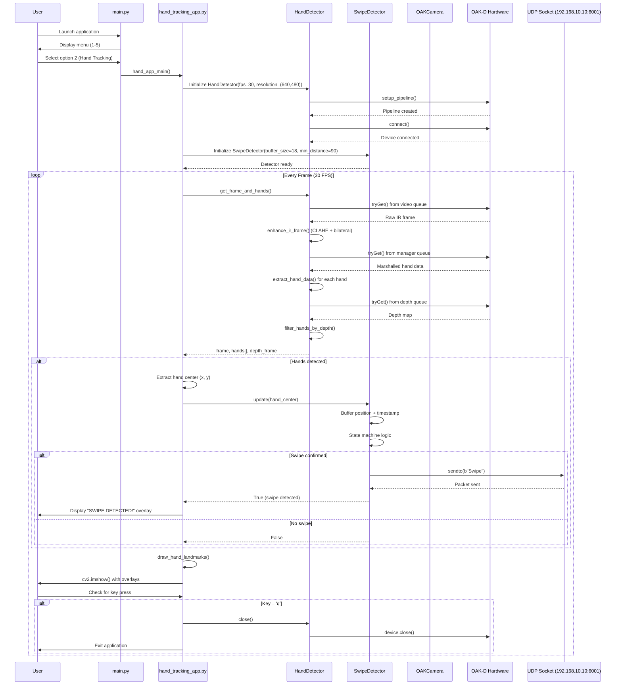

# Application Architecture / アプリケーションアーキテクチャ

**English** | [日本語](#日本語版-1)

---

## Overview

This document provides a comprehensive architectural overview of the TG_25_GestureOAK-D hand detection and gesture recognition system.

---

## System Architecture Diagram

```
┌──────────────────────────────────────────────────────────────────┐
│                     APPLICATION LAYER                            │
│  ┌────────────────────────────────────────────────────────────┐  │
│  │  Entry Points                                              │  │
│  │  ├─ main.py (Interactive Menu)                             │  │
│  │  ├─ run_hand_tracking.py (Direct Execution)                │  │
│  │  ├─ TG25_Launcher.py (GUI Launcher)                        │  │
│  │  └─ probe_dai.py (Diagnostic Tool)                         │  │
│  └────────────────────────────────────────────────────────────┘  │
│                                                                  │
│  ┌────────────────────────────────────────────────────────────┐  │
│  │  Application Modules (apps/)                               │  │
│  │  ├─ hand_tracking_app.py                                   │  │
│  │  │    └─ Full-featured hand + swipe detection              │  │
│  │  ├─ swipe_detection_app.py                                 │  │
│  │  │    └─ Swipe-focused minimal UI                          │  │
│  │  └─ motion_swipe_app.py                                    │  │
│  │       └─ Motion-based alternative approach                 │  │
│  └────────────────────────────────────────────────────────────┘  │
└──────────────────────────────────────────────────────────────────┘
                                │
┌──────────────────────────────────────────────────────────────────┐
│                     DETECTION LAYER                              │
│  ┌────────────────────────────────────────────────────────────┐  │
│  │  Core Detection (detection/)                               │  │
│  │  ├─ hand_detector.py                                       │  │
│  │  │    ├─ MediaPipe-based palm detection                    │  │
│  │  │    ├─ Hand landmark extraction (21 points)              │  │
│  │  │    ├─ IR enhancement (CLAHE + bilateral)                │  │
│  │  │    └─ Depth-based filtering (300-2000mm)                │  │
│  │  │                                                         │  │
│  │  ├─ swipe_detector.py                                      │  │
│  │  │    ├─ State machine (IDLE→DETECTING→VALIDATING→CONFIRMED)│ │
│  │  │    ├─ Trajectory buffering (18 frames)                  │  │
│  │  │    ├─ Velocity calculation (FPS-independent)            │  │
│  │  │    ├─ Multi-criteria validation                         │  │
│  │  │    └─ UDP notification (192.168.10.10:6001)             │  │
│  │  │                                                         │  │
│  │  ├─ motion_detector.py                                     │  │
│  │  │    └─ Alternative motion-based detection                │  │
│  │  └─ motion_swipe_detector.py                               │  │
│  │       └─ Motion-specific swipe logic                       │  │
│  └────────────────────────────────────────────────────────────┘  │
└──────────────────────────────────────────────────────────────────┘
                                │
┌──────────────────────────────────────────────────────────────────┐
│                     HARDWARE LAYER                               │
│  ┌────────────────────────────────────────────────────────────┐  │
│  │  OAK-D Camera Interface (core/)                            │  │
│  │  └─ oak_camera.py                                          │  │
│  │      ├─ Pipeline creation                                  │  │
│  │      ├─ Camera configuration (RGB/IR)                      │  │
│  │      └─ Frame acquisition (non-blocking)                   │  │
│  └────────────────────────────────────────────────────────────┘  │
│                                                                  │
│  ┌────────────────────────────────────────────────────────────┐  │
│  │  DepthAI Pipeline (On-Device Processing)                   │  │
│  │  ┌──────────────────────────────────────────────────────┐  │  │
│  │  │  IR Mono Cameras (LEFT + RIGHT @ 400p, 30fps)        │  │  │
│  │  │    ↓                    ↓                            │  │  │
│  │  │  StereoDepth          MonoCamera                     │  │  │
│  │  │    ↓                    ↓                            │  │  │
│  │  │  Depth Map           ImageManip (resize + RGB888p)   │  │  │
│  │  │    ↓                    ↓                            │  │  │
│  │  │  depth_out           cam_out (XLinkOut to Host)      │  │  │
│  │  └──────────────────────────────────────────────────────┘  │  │
│  │  ┌──────────────────────────────────────────────────────┐  │  │
│  │  │  Neural Networks (VPU Execution)                     │  │  │
│  │  │    ├─ Palm Detection NN (palm_detection_sh4.blob)    │  │  │
│  │  │    │    Input: 128×128 RGB                           │  │  │
│  │  │    │    Output: Bounding boxes + scores              │  │  │
│  │  │    │                                                 │  │  │
│  │  │    ├─ Postprocessing NN (PDPostProcessing_top2_sh1.blob)│  │
│  │  │    │    Function: NMS + top-2 hand selection         │  │  │
│  │  │    │                                                 │  │  │
│  │  │    └─ Landmark NN (hand_landmark_lite_sh4.blob)      │  │  │
│  │  │         Input: 224×224 RGB                           │  │  │
│  │  │         Output: 21 keypoints per hand                │  │  │
│  │  └──────────────────────────────────────────────────────┘  │  │
│  │  ┌──────────────────────────────────────────────────────┐  │  │
│  │  │  Script Node (On-Device Orchestration)               │  │  │
│  │  │    ├─ Coordinates NN execution flow                  │  │  │
│  │  │    ├─ Implements NMS and score filtering             │  │  │
│  │  │    ├─ ROI calculation for landmark NN                │  │  │
│  │  │    └─ Marshals results → manager_out (XLinkOut)      │  │  │
│  │  └──────────────────────────────────────────────────────┘  │  │
│  └────────────────────────────────────────────────────────────┘  │
└──────────────────────────────────────────────────────────────────┘
                                │
                        OAK-D-PRO Hardware
                    (USB 3.0/3.1 Connection)
```

---

## Data Flow Sequence

### Frame-by-Frame Processing Pipeline

```
┌─────────────────────────────────────────────────────────────┐
│ 1. CAMERA CAPTURE (On-Device)                               │
│    IR Left Camera (400p @ 30fps) ──┐                        │
│    IR Right Camera (400p @ 30fps) ─┘                        │
│              ↓                                              │
│ 2. STEREO DEPTH COMPUTATION (On-Device)                     │
│    - Disparity calculation                                  │
│    - Median filtering (7×7 kernel)                          │
│    - Left-right consistency check                           │
│    - Subpixel refinement                                    │
│    Output: Depth map (mm precision)                         │
│              ↓                                              │
│ 3. IMAGE PREPROCESSING (On-Device)                          │
│    - Resize to 640×480                                      │
│    - Convert mono to RGB888p format                         │
│    - Send to host via XLinkOut                              │
│              ↓                                              │
└─────────────────────────────────────────────────────────────┘
                        ↓
┌─────────────────────────────────────────────────────────────┐
│ 4. HOST-SIDE ENHANCEMENT (Python)                           │
│    - Convert RGB to grayscale                               │
│    - CLAHE (clipLimit=2.0, tileGridSize=8×8)                │
│    - Bilateral filter (d=5, sigmaColor=50, sigmaSpace=50)   │
│    - Convert back to RGB                                    │
│              ↓                                              │
└─────────────────────────────────────────────────────────────┘
                        ↓
┌─────────────────────────────────────────────────────────────┐
│ 5. PALM DETECTION (On-Device NN)                            │
│    - ImageManip: Extract 128×128 ROI                        │
│    - Palm NN inference                                      │
│    - Output: Palm bounding boxes + scores                   │
│              ↓                                              │
│ 6. POSTPROCESSING (On-Device NN)                            │
│    - Non-Maximum Suppression (NMS)                          │
│    - Select top-2 palm detections                           │
│    - Filter by score threshold (default: 0.10)              │
│              ↓                                              │
│ 7. LANDMARK DETECTION (On-Device NN)                        │
│    - For each palm:                                         │
│      - ImageManip: Extract rotated 224×224 ROI              │
│      - Landmark NN inference                                │
│      - Output: 21 hand keypoints (x, y, z)                  │
│              ↓                                              │
│ 8. SCRIPT NODE ORCHESTRATION (On-Device)                    │
│    - Combine palm + landmark results                        │
│    - Calculate hand region rectangles                       │
│    - Marshal data (Python pickle format)                    │
│    - Send to host via manager_out queue                     │
│              ↓                                              │
└─────────────────────────────────────────────────────────────┘
                        ↓
┌─────────────────────────────────────────────────────────────┐
│ 9. HOST-SIDE PROCESSING (Python)                            │
│    A. Unmarshal results                                     │
│    B. Create HandRegion objects                             │
│    C. Transform landmarks to pixel coordinates              │
│    D. Remove padding offsets                                │
│              ↓                                              │
│ 10. DEPTH-BASED FILTERING                                   │
│     - For each detected hand:                               │
│       - Extract depth at hand center                        │
│       - Validate depth range (300-2000mm)                   │
│       - Calculate ROI depth statistics                      │
│       - Compute std deviation                               │
│       - Apply distance-aware tolerance                      │
│       - Assign confidence score                             │
│       - Filter out invalid detections                       │
│              ↓                                              │
│ 11. SWIPE DETECTION                                         │
│     - Buffer hand center position (x, y)                    │
│     - Buffer timestamp                                      │
│     - State machine update:                                 │
│       * IDLE: Check for rightward motion start              │
│       * DETECTING: Track cumulative distance                │
│       * VALIDATING: Check velocity/duration/deviation       │
│       * CONFIRMED: Send UDP + reset                         │
│              ↓                                              │
│ 12. VISUALIZATION (OpenCV)                                  │
│     - Draw hand landmarks (21 points)                       │
│     - Draw bounding boxes                                   │
│     - Overlay depth info                                    │
│     - Display gesture label                                 │
│     - Show swipe progress                                   │
│     - Render statistics (FPS, swipe count)                  │
│              ↓                                              │
└─────────────────────────────────────────────────────────────┘
                        ↓
              cv2.imshow() Display
```

---

## Component Interaction Diagram



---

## Module Dependency Graph

```
main.py
  │
  ├─→ gesture_oak.apps.hand_tracking_app
  │     ├─→ gesture_oak.detection.hand_detector
  │     │     ├─→ gesture_oak.core.oak_camera
  │     │     ├─→ gesture_oak.utils.mediapipe_utils
  │     │     ├─→ gesture_oak.utils.FPS
  │     │     ├─→ depthai
  │     │     ├─→ cv2
  │     │     └─→ numpy
  │     │
  │     └─→ gesture_oak.detection.swipe_detector
  │           ├─→ collections (deque)
  │           ├─→ socket (UDP)
  │           └─→ numpy
  │
  ├─→ gesture_oak.apps.swipe_detection_app
  │     └─→ (same dependencies as hand_tracking_app)
  │
  ├─→ gesture_oak.apps.motion_swipe_app
  │     ├─→ gesture_oak.detection.motion_detector
  │     └─→ gesture_oak.detection.motion_swipe_detector
  │
  └─→ gesture_oak.core.oak_camera.test_camera_connection
        └─→ depthai, cv2
```

---

## Design Patterns Used

### 1. Factory Pattern
**Location**: `OAKCamera.setup_pipeline()`  
**Purpose**: Create different pipeline configurations based on camera mode (RGB vs IR)  
**Implementation**:
```python
def setup_pipeline(self) -> dai.Pipeline:
    if self.use_rgb:
        # Factory creates RGB camera pipeline
        cam = pipeline.create(dai.node.ColorCamera)
    else:
        # Factory creates IR mono camera pipeline
        cam = pipeline.create(dai.node.MonoCamera)
```

### 2. State Machine Pattern
**Location**: `SwipeDetector`  
**Purpose**: Manage gesture detection lifecycle  
**States**: `IDLE → DETECTING → VALIDATING → CONFIRMED`  
**Implementation**:
```python
class SwipeState(Enum):
    IDLE = "idle"
    DETECTING = "detecting"
    VALIDATING = "validating"
    CONFIRMED = "confirmed"
```

### 3. Template Method Pattern
**Location**: `HandDetector.build_manager_script()`  
**Purpose**: Generate on-device script from template  
**Implementation**:
```python
template = Template(raw_script_code)
code = template.substitute(
    _pd_score_thresh=self.pd_score_thresh,
    _img_h=self.img_h,
    # ... parameter substitution
)
```

### 4. Observer Pattern
**Location**: Frame processing loop  
**Purpose**: Reactive updates when camera frames arrive  
**Implementation**: Non-blocking queue polling with `tryGet()`

### 5. Strategy Pattern
**Location**: Multiple detection approaches (MediaPipe vs Motion)  
**Purpose**: Interchangeable detection algorithms  
**Implementation**: Common interface, different implementations

---

## Configuration Points

### Application-Level Configuration

| Parameter | File | Line | Default | Description |
|-----------|------|------|---------|-------------|
| Menu options | main.py | 9-13 | 1-5 | Application selection menu |
| Demo selection | main.py | 17-41 | - | User choice routing |

### Detector-Level Configuration

| Parameter | File | Default | Range | Description |
|-----------|------|---------|-------|-------------|
| FPS | hand_detector.py | 30 | 15-60 | Target frame rate |
| Resolution | hand_detector.py | (640,480) | - | Frame dimensions |
| Palm score threshold | hand_detector.py | 0.10 | 0.0-1.0 | Detection confidence |
| Depth range | hand_detector.py | 300-2000 | 100-5000 | Valid depth (mm) |
| Buffer size | swipe_detector.py | 18 | 5-30 | Trajectory history |
| Min distance | swipe_detector.py | 90 | 30-200 | Swipe travel (px) |
| Min velocity | swipe_detector.py | 35 | 10-100 | Speed threshold (px/s) |
| Max velocity | swipe_detector.py | 900 | 300-2000 | Speed ceiling (px/s) |
| Y deviation | swipe_detector.py | 0.35 | 0.1-0.5 | Vertical tolerance |
| Cooldown | swipe_detector.py | 0.8 | 0.3-2.0 | Re-trigger delay (s) |

---

## Extension Points

### Adding a New Gesture

1. **Define gesture logic** in `gesture_classifier.py`:
```python
def recognize_peace_sign(hand: HandRegion) -> bool:
    # Check if index and middle fingers extended
    # Check other fingers curled
    return is_peace_gesture
```

2. **Integrate into detection**:
```python
# In hand_tracking_app.py
if hasattr(hand, 'landmarks'):
    hand.gesture = recognize_peace_sign(hand)
```

### Adding a New Detection Mode

1. **Create detector module** in `detection/`:
```python
# gesture_oak/detection/custom_detector.py
class CustomDetector:
    def __init__(self, ...):
        pass
    
    def update(self, frame):
        # Custom detection logic
        pass
```

2. **Create application** in `apps/`:
```python
# gesture_oak/apps/custom_app.py
def main():
    detector = CustomDetector()
    # Application loop
```

3. **Add to main menu**:
```python
# main.py
from gesture_oak.apps.custom_app import main as custom_main

# In menu
elif choice == '6':
    custom_main()
```

---

# 日本語版

## 概要

このドキュメントは、TG_25_GestureOAK-D手検出およびジェスチャー認識システムの包括的なアーキテクチャ概要を提供します。

---

## システムアーキテクチャ図

```
┌──────────────────────────────────────────────────────────────────┐
│                     アプリケーション層                             │
│  ┌────────────────────────────────────────────────────────────┐  │
│  │  エントリーポイント                                          │  │
│  │  ├─ main.py（インタラクティブメニュー）                       │  │
│  │  ├─ run_hand_tracking.py（直接実行）                        │  │
│  │  ├─ TG25_Launcher.py（GUIランチャー）                       │  │
│  │  └─ probe_dai.py（診断ツール）                              │  │
│  └────────────────────────────────────────────────────────────┘  │
│                                                                  │
│  ┌────────────────────────────────────────────────────────────┐  │
│  │  アプリケーションモジュール（apps/）                          │  │
│  │  ├─ hand_tracking_app.py                                   │  │
│  │  │    └─ フル機能手+スワイプ検出                             │  │
│  │  ├─ swipe_detection_app.py                                 │  │
│  │  │    └─ スワイプ専用最小UI                                 │  │
│  │  └─ motion_swipe_app.py                                    │  │
│  │       └─ モーションベース代替アプローチ                       │  │
│  └────────────────────────────────────────────────────────────┘  │
└──────────────────────────────────────────────────────────────────┘
                                │
┌──────────────────────────────────────────────────────────────────┐
│                     検出層                                        │
│  ┌────────────────────────────────────────────────────────────┐  │
│  │  コア検出（detection/）                                     │  │
│  │  ├─ hand_detector.py                                       │  │
│  │  │    ├─ MediaPipeベースパーム検出                          │  │
│  │  │    ├─ ハンドランドマーク抽出（21点）                      │  │
│  │  │    ├─ IR強調処理（CLAHE + バイラテラル）                  │  │
│  │  │    └─ 深度ベースフィルタリング（300-2000mm）               │  │
│  │  │                                                         │  │
│  │  ├─ swipe_detector.py                                      │  │
│  │  │    ├─ ステートマシン（IDLE→DETECTING→VALIDATING→CONFIRMED）  │
│  │  │    ├─ 軌跡バッファリング（18フレーム）                     │  │
│  │  │    ├─ 速度計算（FPS非依存）                               │  │
│  │  │    ├─ 多基準検証                                         │  │
│  │  │    └─ UDP通知（192.168.10.10:6001）                      │  │
│  │  │                                                         │  │
│  │  ├─ motion_detector.py                                     │  │
│  │  │    └─ 代替モーションベース検出                            │  │
│  │  └─ motion_swipe_detector.py                               │  │
│  │       └─ モーション特化スワイプロジック                       │  │
│  └────────────────────────────────────────────────────────────┘  │
└──────────────────────────────────────────────────────────────────┘

[システム図の続きは英語版と同じ構造]
```

---

## データフローシーケンス

### フレームごとの処理パイプライン

```
1. カメラキャプチャ（オンデバイス）
   IRレフトカメラ（400p @ 30fps）
   IRライトカメラ（400p @ 30fps）
   ↓
2. ステレオ深度計算（オンデバイス）
   - 視差計算
   - メディアンフィルタリング（7×7カーネル）
   - 左右一貫性チェック
   - サブピクセル精密化
   出力: 深度マップ（mm精度）
   ↓
3. 画像前処理（オンデバイス）
   - 640×480にリサイズ
   - モノからRGB888p形式に変換
   - XLinkOut経由でホストに送信
   ↓
4. ホスト側強調処理（Python）
   - RGBからグレースケールに変換
   - CLAHE（clipLimit=2.0、tileGridSize=8×8）
   - バイラテラルフィルター（d=5、sigmaColor=50、sigmaSpace=50）
   - RGBに戻す
   ↓
5. パーム検出（オンデバイスNN）
   - ImageManip: 128×128 ROI抽出
   - Palm NN推論
   - 出力: パームバウンディングボックス+スコア
   ↓
6. 後処理（オンデバイスNN）
   - 非最大抑制（NMS）
   - 上位2パーム検出を選択
   - スコア閾値でフィルター（デフォルト: 0.10）
   ↓
7. ランドマーク検出（オンデバイスNN）
   - 各パームに対して:
     - ImageManip: 回転した224×224 ROI抽出
     - Landmark NN推論
     - 出力: 21ハンドキーポイント（x、y、z）
   ↓
8. スクリプトノードオーケストレーション（オンデバイス）
   - パーム+ランドマーク結果を結合
   - 手領域矩形を計算
   - データをマーシャル（Python pickle形式）
   - manager_outキュー経由でホストに送信
   ↓
9. ホスト側処理（Python）
   A. 結果をアンマーシャル
   B. HandRegionオブジェクトを作成
   C. ランドマークをピクセル座標に変換
   D. パディングオフセットを除去
   ↓
10. 深度ベースフィルタリング
    - 検出された各手に対して:
      - 手中心の深度を抽出
      - 深度範囲を検証（300-2000mm）
      - ROI深度統計を計算
      - 標準偏差を計算
      - 距離対応許容値を適用
      - 信頼度スコアを割り当て
      - 無効な検出をフィルター
    ↓
11. スワイプ検出
    - 手中心位置（x、y）をバッファー
    - タイムスタンプをバッファー
    - ステートマシン更新:
      * IDLE: 右方向動作開始をチェック
      * DETECTING: 累積距離を追跡
      * VALIDATING: 速度/持続時間/偏差をチェック
      * CONFIRMED: UDP送信+リセット
    ↓
12. 可視化（OpenCV）
    - ハンドランドマークを描画（21点）
    - バウンディングボックスを描画
    - 深度情報をオーバーレイ
    - ジェスチャーラベルを表示
    - スワイプ進行状況を表示
    - 統計を描画（FPS、スワイプカウント）
    ↓
    cv2.imshow()表示
```

---

## 設定ポイント

### アプリケーションレベル設定

| パラメータ | ファイル | 行 | デフォルト | 説明 |
|-----------|---------|---|-----------|------|
| メニューオプション | main.py | 9-13 | 1-5 | アプリケーション選択メニュー |
| デモ選択 | main.py | 17-41 | - | ユーザー選択ルーティング |

### 検出器レベル設定

| パラメータ | ファイル | デフォルト | 範囲 | 説明 |
|-----------|---------|-----------|-----|------|
| FPS | hand_detector.py | 30 | 15-60 | 目標フレームレート |
| 解像度 | hand_detector.py | (640,480) | - | フレーム寸法 |
| パームスコア閾値 | hand_detector.py | 0.10 | 0.0-1.0 | 検出信頼度 |
| 深度範囲 | hand_detector.py | 300-2000 | 100-5000 | 有効深度（mm） |
| バッファサイズ | swipe_detector.py | 18 | 5-30 | 軌跡履歴 |
| 最小距離 | swipe_detector.py | 90 | 30-200 | スワイプ移動（px） |
| 最小速度 | swipe_detector.py | 35 | 10-100 | 速度閾値（px/s） |
| 最大速度 | swipe_detector.py | 900 | 300-2000 | 速度上限（px/s） |
| Y偏差 | swipe_detector.py | 0.35 | 0.1-0.5 | 垂直許容値 |
| クールダウン | swipe_detector.py | 0.8 | 0.3-2.0 | 再トリガー遅延（秒） |

---

## 拡張ポイント

### 新しいジェスチャーの追加

1. **ジェスチャーロジックを定義** `gesture_classifier.py`内:
```python
def recognize_peace_sign(hand: HandRegion) -> bool:
    # 人差し指と中指が伸びているかチェック
    # 他の指が曲がっているかチェック
    return is_peace_gesture
```

2. **検出に統合**:
```python
# hand_tracking_app.py内
if hasattr(hand, 'landmarks'):
    hand.gesture = recognize_peace_sign(hand)
```

### 新しい検出モードの追加

1. **検出器モジュールを作成** `detection/`内:
```python
# gesture_oak/detection/custom_detector.py
class CustomDetector:
    def __init__(self, ...):
        pass
    
    def update(self, frame):
        # カスタム検出ロジック
        pass
```

2. **アプリケーションを作成** `apps/`内:
```python
# gesture_oak/apps/custom_app.py
def main():
    detector = CustomDetector()
    # アプリケーションループ
```

3. **メインメニューに追加**:
```python
# main.py
from gesture_oak.apps.custom_app import main as custom_main

# メニュー内
elif choice == '6':
    custom_main()
```

---

## パフォーマンス特性

### レイテンシ分析

| ステージ | 時間 (ms) | 場所 | 備考 |
|---------|----------|------|------|
| カメラキャプチャ | 33 | デバイス | @30fps |
| 深度計算 | 5-10 | デバイス | VPU並列処理 |
| Palm NN推論 | 8-12 | デバイス | VPU |
| Landmark NN推論 | 10-15 | デバイス | VPU（手ごと） |
| XLinkOut転送 | 2-5 | USB | USB3.0 |
| IR強調処理 | 3-5 | ホスト | OpenCV |
| 深度フィルタリング | 1-2 | ホスト | NumPy |
| スワイプ検出 | <1 | ホスト | 軽量ロジック |
| 可視化 | 5-8 | ホスト | OpenCV描画 |
| **合計レイテンシ** | **67-91** | - | フレームからディスプレイまで |

### スループット

- **目標FPS**: 30
- **達成FPS**: 25-30（IRモード）
- **ボトルネック**: Landmark NN推論（手が複数の場合）
- **最適化**: 非ブロッキングキュー、小さいmaxSize

---

## エラーハンドリング戦略

### レイヤー別エラー処理

#### ハードウェア層
```python
try:
    device = dai.Device(pipeline)
except RuntimeError as e:
    if "X_LINK_DEVICE_NOT_FOUND" in str(e):
        print("OAK-Dが見つかりません。USB接続を確認してください。")
    elif "X_LINK_COMMUNICATION_NOT_OPEN" in str(e):
        print("デバイス通信失敗。再起動してください。")
    else:
        raise
```

#### 検出層
```python
try:
    frame, hands, depth = detector.get_frame_and_hands()
except Exception as e:
    print(f"検出エラー: {e}")
    continue  # 次のフレームへ
```

#### アプリケーション層
```python
try:
    # メインループ
    while True:
        process_frame()
except KeyboardInterrupt:
    print("ユーザーによる中断")
finally:
    cleanup_resources()
```

---

## セキュリティ考慮事項

### UDP通信
- **暗号化**: なし（ローカルネットワーク想定）
- **認証**: なし
- **推奨**: VPN/ファイアウォール設定でネットワークセグメント保護

### ファイルシステムアクセス
- **停止フラグファイル**: `TG25_STOP.flag`
- **保存フレーム**: 現在のディレクトリ（書き込み権限必要）
- **推奨**: 専用ディレクトリでアプリケーション実行

---

## テスト戦略

### ユニットテスト
```python
# tests/test_swipe_detector.py
def test_swipe_validation():
    detector = SwipeDetector()
    # 有効なスワイプをシミュレート
    for i in range(20):
        detector.update((i * 10, 50))
    assert detector.total_swipes_detected == 1
```

### 統合テスト
```python
# tests/test_hand_detector.py
def test_hand_detection_pipeline():
    detector = HandDetector()
    assert detector.connect()
    frame, hands, depth = detector.get_frame_and_hands()
    assert frame is not None
    detector.close()
```

### システムテスト
- カメラ接続テスト: `python probe_dai.py`
- エンドツーエンドテスト: `python main.py` → オプション2
- パフォーマンステスト: FPSカウンター監視

---

## デプロイメントアーキテクチャ

### 開発環境
```
開発マシン
├── Python 3.10+ (仮想環境)
├── OAK-D via USB 3.0
├── ソースコード (.py)
└── モデル (.blob)
```

### 本番環境
```
ターゲットマシン
├── TG25_Launcher.exe (GUIランチャー)
├── TG25_HandTracking.exe (ワーカー)
├── models/ (ニューラルネットワーク)
├── 依存DLL
└── OAK-D via USB 3.0
```

### ネットワークトポロジー
```
[OAK-Dカメラ] ─USB─ [ホストPC] ─UDP─ [192.168.10.10:6001]
                         │
                    (手検出+スワイプ)
```

---

## 保守とモニタリング

### ログ出力
- **コンソール**: リアルタイム検出イベント
- **ファイル**: なし（実装推奨）
- **レベル**: INFO（デフォルト）、DEBUG（開発用）

### 監視メトリクス
- FPS（フレーム毎秒）
- 検出された手の数
- スワイプカウント
- フィルタリングされた誤検出
- USB速度
- 深度信頼度

### メンテナンスタスク
- **週次**: ケーブル接続確認
- **月次**: カメラレンズクリーニング
- **四半期**: モデル更新チェック
- **年次**: ハードウェア点検

---

## 用語集

| 用語 | 説明 |
|------|------|
| **DepthAI** | Luxonisが開発したOAK-Dカメラ用SDK |
| **VPU** | Vision Processing Unit（Myriad X） |
| **XLinkOut** | デバイスからホストへのデータストリーム |
| **ImageManip** | オンデバイス画像変換ノード |
| **Script Node** | オンデバイスPythonスクリプト実行 |
| **NMS** | Non-Maximum Suppression（重複除去） |
| **CLAHE** | Contrast Limited Adaptive Histogram Equalization |
| **Bilateral Filter** | エッジ保存平滑化フィルター |
| **Stereo Depth** | ステレオカメラペアからの深度推定 |
| **Disparity** | ステレオ画像間のピクセルシフト |
| **Subpixel** | 分数ピクセル精度の深度 |
| **Marshal** | Pythonオブジェクトのバイナリシリアライズ |
| **Deque** | 両端キュー（double-ended queue） |
| **ROI** | Region of Interest（関心領域） |

---

## 参考資料

### 公式ドキュメント
- DepthAI API: https://docs.luxonis.com/
- MediaPipe Hands: https://google.github.io/mediapipe/solutions/hands
- OpenCV Python: https://docs.opencv.org/4.x/d6/d00/tutorial_py_root.html

### 関連プロジェクト
- depthai-python: https://github.com/luxonis/depthai-python
- mediapipe: https://github.com/google/mediapipe

---

**ドキュメント作成日**: 2024年10月  
**バージョン**: 1.0  
**著者**: TG_25_GestureOAK-Dチーム